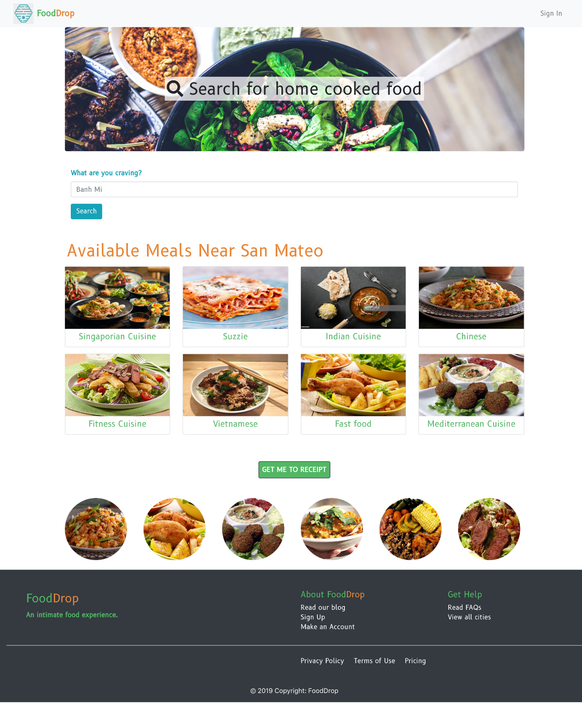
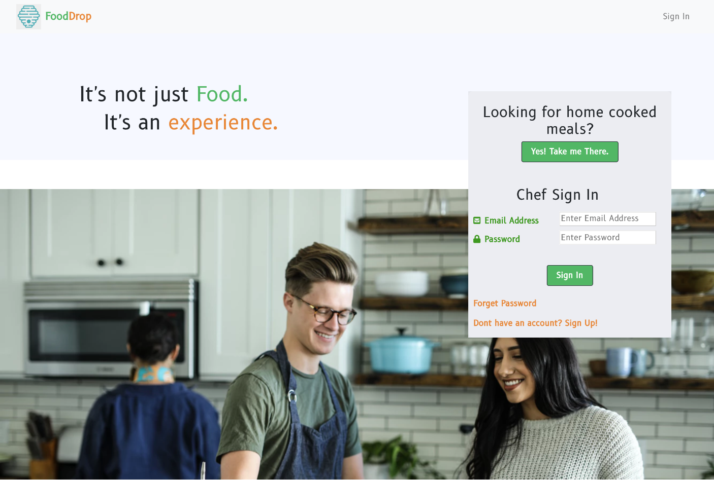
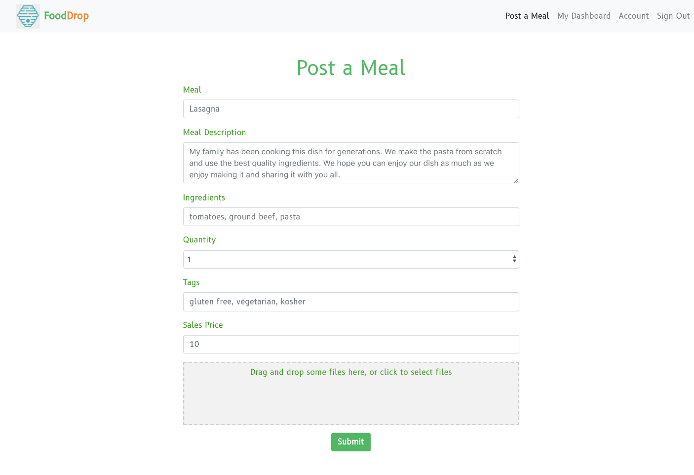
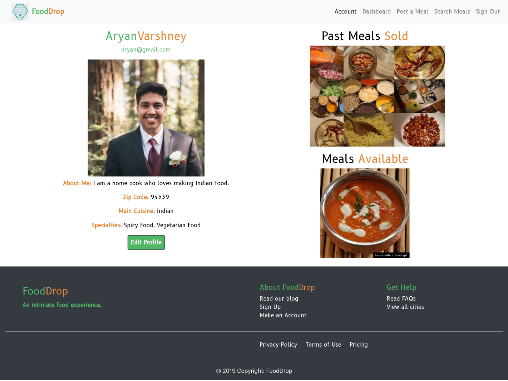

# Hackathon-Freedom

FoodDrop
Jun 2019

Project description: HEROthon Draper University Summer 2019 Hackathon

150+ developers, business entrepreneurs and UI/UX designers work in teams to research, create, build and pitch a project around the theme of freedom within 40 hours. 

Our team of 7 (4 developers, 3 entrepreneurs/researchers) created FoodDrop, a mix between Instagram/Airbnb/UberEats. We felt there was a lack of home cooked meal options for consumers and wanted to create a platform which would support communities and provide opportunities for chefs/ people who enjoy cooking all around the world. 

Our cooks are cultural influencers. They not only provide communities with home cooked meal options, but they also use our platform to share their stories, share their food blogs and share photos of their meals. 

For our customers, we provide the ability to order home cooked meals through our site and to be able to review orders as well as provide feedback to the chefs. 

FoodDrop would change the way consumers view and experience home cooked meals and bring about more appreciation for our chefs/neighbors and an avenue to support our communities. 

FoodDrop placed 3rd place out of 22 teams.

#
Landing Page

Sign In Page

Chef Posts a Meal

Chef Profile Page

## Built With
- Bootstrap
- Google Fonts
- JavaScript
- React
- NPM packages
   * axios
   * react-dom
   * react-bootstrap
   * react-dropzone
   * react-router-dom
   * react-scripts
   * react-star-rating-component

## Authors
Jennifer Powell 
Melanie Marsollier
Aryan Varshney
